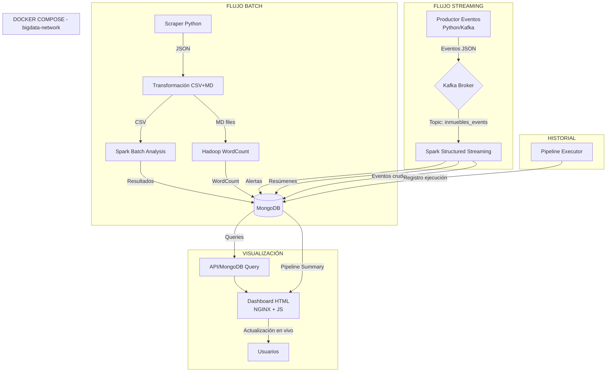

# 📋 AA4 - Plan de Trabajo por Roles
## Inmuebles Big Data - Grupo 3

**Proyecto:** Análisis de Mercado Inmobiliario con Ecosistema Big Data  
**Evaluación:** AA4 - Aplicando Tecnologías para las Soluciones Big Data II  
**Equipo:** 5 Integrantes  
**Fecha:** Mayo 2026

---

## 📌 Resumen del Proyecto AA4

### ¿Qué se debe hacer?

Evolucionar el pipeline actual (AA3) hacia una solución Big Data integral que incluya **procesamiento streaming con Kafka y Spark Structured Streaming**, además de mejorar la persistencia histórica y la visualización en tiempo real.

### Cambios principales respecto a AA3

| Aspecto | AA3 (Actual) | AA4 (Objetivo) |
|---------|-------------|----------------|
| **Procesamiento** | Solo batch | Batch + Streaming |
| **Eventos** | No existen | Eventos simulados con Kafka (1000-3000) |
| **Dashboard** | HTML estático con datos JSON | HTML que lee de MongoDB + streaming |
| **Historial** | Se reinicia cada ejecución | Se preserva histórico de pipelines |
| **Arquitectura** | Pipeline → Hadoop → Spark → MongoDB → Dashboard | Igual + Kafka → Spark Streaming → Dashboard en vivo |

### Nuevos componentes a incorporar

```
Kafka (Zookeeper + Broker)
    ↓
Productor de Eventos (simula eventos inmobiliarios)
    ↓
Topic en Kafka (inmuebles_events)
    ↓
Spark Structured Streaming (procesa micro-batches)
    ↓
MongoDB (colecciones nuevas: eventos_streaming, alertas)
    ↓
Dashboard actualizado en tiempo real (lee de MongoDB vía API)
```

---

## 🏗️ Arquitectura Propuesta para AA4



---

## 📊 Tabla de Datos y Archivos (Requerimiento del Profesor)

| Archivo | Formato | Cantidad Registros | Fuente | Uso dentro del proyecto |
|---------|---------|-------------------|--------|------------------------|
| `inmuebles_adondevivir.json` | JSON | ~1,800 | Scraping AdondeVivir | Datos crudos portal 1 |
| `inmuebles_infocasas.json` | JSON | ~450 | Scraping InfoCasas | Datos crudos portal 2 |
| `inmuebles_laencontre.json` | JSON | ~320 | Scraping LaEncontre | Datos crudos portal 3 |
| `inmuebles_todos.json` | JSON | ~2,570 | Consolidación pipeline | Dataset unificado para MongoDB |
| `inmuebles.csv` | CSV | ~2,570 | Transformación pipeline | Input principal para Spark Batch |
| `descripciones_*.md` | MD | 3 archivos | Transformación pipeline | Input para Hadoop WordCount |
| `eventos_inmobiliarios.py` | Python | 1,000-3,000 eventos | Simulación / Productor Kafka | Generación de eventos streaming |
| `eventos_streaming.json` (en MongoDB) | JSON (BSON) | 1,000-3,000 | Kafka → Spark Streaming | Procesamiento en tiempo real |
| `alertas_streaming.json` (en MongoDB) | JSON (BSON) | Variable | Spark Streaming | Alertas generadas por reglas |
| `pipeline_summary` (en MongoDB) | JSON (BSON) | Por ejecución | Pipeline orchestrator | Historial de ejecuciones |

---

## 👥 Roles y Asignación de Tareas

| Rol | Área Principal | Integrante Asignado |
|-----|---------------|-------------------|
| **Rol 1** | Infraestructura Kafka + Docker | Integrante 1 |
| **Rol 2** | Productor de Eventos Streaming | Integrante 2 |
| **Rol 3** | Spark Structured Streaming | Integrante 3 |
| **Rol 4** | Dashboard en Tiempo Real + Historial | Integrante 4 |
| **Rol 5** | Documentación, Datos y Arquitectura | Integrante 5 |

---

# Rol 1: Infraestructura Kafka + Docker
### 🎯 Responsable: Integrante 1

### 📋 Descripción
Agregar Kafka (Zookeeper + Broker) al ecosistema Docker, configurar redes, volúmenes y topics necesarios. Asegurar que todos los servicios (productor, Spark streaming, dashboard) puedan comunicarse con Kafka. También debe actualizar el Dockerfile del pipeline para incluir las librerías de Kafka.

### 📦 Archivos que modificará
| Archivo | Acción |
|---------|--------|
| `docker-compose.yml` | Agregar servicios `zookeeper` y `kafka` |
| `pipeline/Dockerfile` | Agregar dependencias de Kafka (kafka-python) |
| `pipeline/requirements.txt` | Agregar `kafka-python` |
| `.env` o variables de entorno | Configurar `KAFKA_BOOTSTRAP_SERVERS` |

### ✅ Backlog / Checklist

- [ ] 1.1 Agregar servicio `zookeeper` al `docker-compose.yml`
- [ ] 1.2 Agregar servicio `kafka` al `docker-compose.yml`
- [ ] 1.3 Configurar healthcheck para Kafka
- [ ] 1.4 Agregar dependencias Kafka al contenedor pipeline (`kafka-python` en requirements.txt)
- [ ] 1.5 Crear topic `inmuebles_events` automáticamente al iniciar Kafka (con script de init o configuración)
- [ ] 1.6 Crear topic `inmuebles_alerts` para alertas
- [ ] 1.7 Crear script `pipeline/kafka_setup.py` que verifique/crea topics al iniciar
- [ ] 1.8 Verificar conectividad entre contenedores: pipeline → kafka:9092
- [ ] 1.9 Actualizar `pipeline/run_pipeline.py` para que llame a `kafka_setup.py` al inicio
- [ ] 1.10 Hacer commit con mensaje: `[Rol 1] Infraestructura Kafka agregada a Docker Compose`

### 💻 Prompt para IA (Copia y pega esto como contexto para tu asistente IA)

```
Eres el Integrante 1 del Grupo 3 del proyecto "Análisis de Mercado Inmobiliario con Ecosistema Big Data".

Contexto del proyecto:
- El proyecto usa Docker Compose con 8 servicios: mongodb, namenode, datanode, resourcemanager, nodemanager, historyserver, pipeline, dashboard
- Todos los servicios están en la red `bigdata-network` (bridge)
- El contenedor `pipeline` ejecuta el orquestador principal y tiene Python/Spark instalado
- El archivo docker-compose.yml está en la raíz del proyecto

Tu tarea es agregar Kafka al ecosistema. Debes:

1. **Agregar Zookeeper** al docker-compose.yml (imagen: confluentinc/cp-zookeeper:7.5.0)
   - Puerto 2181
   - Variable de entorno: ZOOKEEPER_CLIENT_PORT=2181
   - Red: bigdata-network
   - Healthcheck básico

2. **Agregar Kafka Broker** al docker-compose.yml (imagen: confluentinc/cp-kafka:7.5.0)
   - Puerto 9092 (interno) y 29092 (externo)
   - Variables de entorno:
     - KAFKA_BROKER_ID=1
     - KAFKA_ZOOKEEPER_CONNECT=zookeeper:2181
     - KAFKA_ADVERTISED_LISTENERS=PLAINTEXT://kafka:9092,PLAINTEXT_HOST://localhost:29092
     - KAFKA_LISTENER_SECURITY_PROTOCOL_MAP=PLAINTEXT:PLAINTEXT,PLAINTEXT_HOST:PLAINTEXT
     - KAFKA_INTER_BROKER_LISTENER_NAME=PLAINTEXT
     - KAFKA_OFFSETS_TOPIC_REPLICATION_FACTOR=1
   - Depende de: zookeeper (condition: service_started)
   - Red: bigdata-network
   - Healthcheck: usando kafka-broker-api-versions.sh
   - Volumen: kafka_data:/var/lib/kafka/data

3. **Agregar volúmenes** al archivo:
   - zookeeper_data
   - kafka_data

4. **Actualizar pipeline/requirements.txt** agregando:
   - kafka-python>=2.0.2

5. **Crear el script** pipeline/kafka_setup.py que:
   - Importa `from kafka.admin import KafkaAdminClient, NewTopic`
   - Se conecta a kafka:9092
   - Crea los topics: 'inmuebles_events' (3 particiones, replication=1), 'inmuebles_alerts' (1 partición)
   - Maneja errores si el topic ya existe
   - Retorna True si todo OK

6. **Modificar pipeline/run_pipeline.py** al inicio del main() para que ejecute kafka_setup.py

7. **Actualizar pipeline/Dockerfile** si es necesario (pip ya instalaría desde requirements.txt)

IMPORTANTE: Usa Windows PowerShell (no Bash). No uses &&. 

Los archivos que debes modificar/crear son:
- docker-compose.yml (modificar)
- pipeline/requirements.txt (modificar)
- pipeline/kafka_setup.py (crear)
- pipeline/run_pipeline.py (modificar)
- pipeline/Dockerfile (solo si es necesario)
```

---

# Rol 2: Productor de Eventos Streaming (Kafka Producer)
### 🎯 Responsable: Integrante 2

### 📋 Descripción
Crear un productor de eventos simulados en Kafka que genere entre 1,000 y 3,000 eventos inmobiliarios. Los eventos deben representar acciones reales del mercado: nuevas propiedades publicadas, cambios de precio, propiedades vendidas/alquiladas, consultas de usuarios. Debe incluir al menos 4 tipos de eventos y 2 reglas de alerta.

### 📦 Archivos que modificará/creará
| Archivo | Acción |
|---------|--------|
| `pipeline/kafka_producer.py` | Crear - Productor de eventos |
| `pipeline/run_pipeline.py` | Modificar - Agregar step de eventos |
| `pipeline/requirements.txt` | Ya tiene kafka-python (Rol 1) |

### ✅ Backlog / Checklist

- [ ] 2.1 Definir 4+ tipos de eventos inmobiliarios
- [ ] 2.2 Definir 2+ reglas de alerta
- [ ] 2.3 Crear `pipeline/kafka_producer.py` con la simulación de eventos
- [ ] 2.4 Enviar eventos al topic `inmuebles_events`
- [ ] 2.5 Generar entre 1,000 y 3,000 eventos
- [ ] 2.6 Incluir timestamp y metadata en cada evento
- [ ] 2.7 Probar que los eventos llegan a Kafka (consumer de prueba)
- [ ] 2.8 Integrar el productor en el pipeline (nuevo step en run_pipeline.py)
- [ ] 2.9 Hacer commit con mensaje: `[Rol 2] Productor de eventos Kafka implementado`

### 💻 Prompt para IA (Copia y pega esto como contexto para tu asistente IA)

```
Eres el Integrante 2 del Grupo 3 del proyecto "Análisis de Mercado Inmobiliario con Ecosistema Big Data".

Contexto del proyecto:
- El pipeline se ejecuta en un contenedor Docker y orquesta 6 pasos (scraper, transform, MongoDB, Hadoop, Spark, resultados)
- Kafka ya está configurado en docker-compose con el broker en kafka:9092
- Topic creado: 'inmuebles_events'
- Dependencia instalada: kafka-python>=2.0.2

Tu tarea es crear un productor que simule eventos inmobiliarios en tiempo real.

Debes crear el archivo `pipeline/kafka_producer.py` con:

1. **Importaciones:**
   - from kafka import KafkaProducer
   - import json, time, random, uuid
   - from datetime import datetime, timedelta

2. **Configuración:**
   - KAFKA_BOOTSTRAP_SERVERS = os.environ.get("KAFKA_BOOTSTRAP_SERVERS", "kafka:9092")
   - TOPIC_EVENTS = "inmuebles_events"
   - TOPIC_ALERTS = "inmuebles_alerts"
   - TOTAL_EVENTS = random.randint(1000, 3000) (o configurable)

3. **Definir 4+ tipos de eventos (como mínimo):**
   - `nueva_propiedad`: Se publica una nueva propiedad en un portal
   - `cambio_precio`: Una propiedad existente cambia de precio (sube o baja)
   - `propiedad_vendida`: Una propiedad se marca como vendida/alquilada
   - `consulta_usuario`: Un usuario consulta propiedades con ciertos filtros
   - `propiedad_destacada`: Una propiedad se marca como destacada/premium

4. **Datos simulados de propiedades (lista de distritos, tipos, rangos de precio):**
   - Distritos: Miraflores, San Isidro, Santiago de Surco, La Molina, Barranco, San Borja, Jesús María, Lince, Magdalena, Pueblo Libre
   - Tipos: departamento, casa, terreno, local_comercial
   - Monedas: PEN, USD
   - Portales: adondevivir, infocasas, laencontre

5. **Estructura de cada evento (JSON):**
   json
   {
     "event_id": "uuid",
     "event_type": "nueva_propiedad|cambio_precio|propiedad_vendida|consulta_usuario|propiedad_destacada",
     "timestamp": "2026-05-10T20:00:00Z",
     "data": {
       "property_id": "prop_123",
       "title": "Departamento en Miraflores",
       "price": 392773,
       "currency": "PEN",
       "district": "Miraflores",
       "property_type": "departamento",
       "bedrooms": 3,
       "bathrooms": 2,
       "area": 120,
       "portal": "adondevivir",
       "url": "https://..."
     },
     "metadata": {
       "source": "kafka_producer",
       "version": "1.0"
     }
   }
   

6. **Reglas de alerta (2 como mínimo):**
   - `precio_bajo`: Si una propiedad en Miraflores o San Isidro tiene precio < $80,000 USD, generar alerta
   - `oportunidad_inversion`: Si una propiedad tiene área > 150m² y precio < $150,000 USD, generar alerta
   - Las alertas se envían al topic 'inmuebles_alerts'

7. **Función `generate_event()`** que devuelva un evento aleatorio realista

8. **Función `check_alert_rules(event)`** que evalúe las reglas y retorne alertas si corresponde

9. **Función `run_producer(num_events=1500, delay=0.1)`** que:
   - Crea el producer: KafkaProducer(bootstrap_servers=..., value_serializer=lambda v: json.dumps(v).encode())
   - Genera num_events eventos
   - Envía cada evento con producer.send(TOPIC_EVENTS, value=evento)
   - Si hay alerta, también envía a TOPIC_ALERTS
   - Pequeño delay (0.05-0.2 seg) entre eventos para simular streaming
   - Imprime progreso cada 100 eventos
   - Retorna estadísticas: total eventos, alertas generadas, tipos

10. **Integrar en run_pipeline.py** (modificar):
    - Agregar step_kafka_events() como nuevo STEP entre MongoDB Load y Hadoop
    - El step importa y llama a run_producer()
    - Registra estadísticas en status_manager

11. **Prueba rápida** (opcional, para desarrollo):
    - Crear un pequeño script de prueba que consuma 5 eventos del topic para verificar

IMPORTANTE: Usa Windows PowerShell (no Bash). No uses &&. 
```


---

# Rol 3: Spark Structured Streaming
### 🎯 Responsable: Integrante 3

### 📋 Descripción
Crear un job de Spark Structured Streaming que lea desde Kafka, procese los eventos en micro-batches, genere resúmenes en tiempo real (mínimo 2), detecte alertas y persista todo en MongoDB. Debe usar DataFrames, Spark SQL y RDD (según corresponda).

### 📦 Archivos que modificará/creará
| Archivo | Acción |
|---------|--------|
| `pipeline/spark_streaming.py` | Crear - Job de Spark Structured Streaming |
| `pipeline/run_pipeline.py` | Modificar - Agregar step de streaming |
| `pipeline/Dockerfile` | Verificar que tenga dependencias Kafka + MongoDB Spark |

### ✅ Backlog / Checklist

- [ ] 3.1 Leer documentación de Spark Structured Streaming + Kafka
- [ ] 3.2 Verificar que Spark tenga el jar `spark-sql-kafka` (o usar `--packages`)
- [ ] 3.3 Crear `pipeline/spark_streaming.py` 
- [ ] 3.4 Leer stream desde Kafka (topic: `inmuebles_events`)
- [ ] 3.5 Parsear eventos JSON con from_json() y schema explícito
- [ ] 3.6 Aplicar transformaciones con DataFrames y Spark SQL
- [ ] 3.7 Generar resúmenes streaming (mínimo 2):
      - Resumen 1: Conteo de eventos por tipo cada 10 segundos (tumbling window)
      - Resumen 2: Precio promedio de propiedades por distrito en ventana deslizante
- [ ] 3.8 Detectar alertas y escribirlas a MongoDB (colección `alertas_streaming`)
- [ ] 3.9 Escribir eventos procesados a MongoDB (colección `eventos_streaming`)
- [ ] 3.10 Usar al menos una operación con RDD (por ejemplo, para transformación personalizada)
- [ ] 3.11 Configurar output mode (append/update/complete según corresponda)
- [ ] 3.12 Integrar en run_pipeline.py como step opcional/paralelo
- [ ] 3.13 Hacer commit con mensaje: `[Rol 3] Spark Structured Streaming con Kafka implementado`

### 💻 Prompt para IA (Copia y pega esto como contexto para tu asistente IA)

```
Eres el Integrante 3 del Grupo 3 del proyecto "Análisis de Mercado Inmobiliario con Ecosistema Big Data".

Contexto del proyecto:
- Spark 3.5.0 está instalado en el contenedor pipeline (modo local[*])
- Kafka está en kafka:9092 con topics: inmuebles_events, inmuebles_alerts
- MongoDB está en mongodb:27017, base de datos: inmuebles
- El pipeline usa PySpark con DataFrames, Spark SQL y RDD
- Dependencias: pymongo, kafka-python ya instaladas

Tu tarea es crear un job de Spark Structured Streaming que procese eventos desde Kafka.

Crea el archivo `pipeline/spark_streaming.py`:

1. **SparkSession con configuración Kafka:**
   python
   spark = SparkSession.builder \
       .appName("InmueblesStreaming") \
       .master("local[*]") \
       .config("spark.jars.packages", 
               "org.apache.spark:spark-sql-kafka-0-10_2.12:3.5.0,"
               "org.mongodb.spark:mongo-spark-connector_2.12:10.2.0") \
       .getOrCreate()
   

2. **Lectura desde Kafka:**
    python
   df_kafka = spark.readStream \
       .format("kafka") \
       .option("kafka.bootstrap.servers", "kafka:9092") \
       .option("subscribe", "inmuebles_events") \
       .option("startingOffsets", "latest") \
       .load()
   

3. **Parsear el valor JSON:**
   - Usar from_json() con schema definido con StructType
   - Extraer campos: event_id, event_type, timestamp, data.*
   - Cachear el DataFrame parseado

4. **Resumen 1 - Eventos por tipo (window de 10 segundos):**
   python
   eventos_por_tipo = df_parsed \
       .withWatermark("timestamp", "20 seconds") \
       .groupBy(
           window(col("timestamp"), "10 seconds"),
           col("event_type")
       ) \
       .agg(count("*").alias("total_eventos"))
   
   - Output: console (para ver en terminal) y MongoDB (colección: resumen_eventos_streaming)

5. **Resumen 2 - Precio promedio por distrito (ventana deslizante 30 seg):**
   python
   precio_promedio_distrito = df_parsed \
       .filter(col("event_type").isin("nueva_propiedad", "cambio_precio")) \
       .withWatermark("timestamp", "30 seconds") \
       .groupBy(
           window(col("timestamp"), "30 seconds", "15 seconds"),
           col("data.district")
       ) \
       .agg(
           avg("data.price").alias("precio_promedio"),
           count("*").alias("total_propiedades")
       )
   
   - Output: MongoDB (colección: resumen_precios_streaming)

6. **Alertas streaming:**
   - Leer del topic inmuebles_alerts (o detectar en el mismo stream)
   - Escribir a MongoDB colección: alertas_streaming
   - Cada alerta debe tener: event_id, tipo_alerta, descripcion, timestamp, datos_relacionados

7. **Operación con RDD (obligatorio para la evaluación):**
   - Agregar un transform personalizado con RDD, por ejemplo:
   python
   # Ejemplo: filtrar eventos con precio anómalo usando RDD
   def detectar_anomalias_rdd(rows):
       # Lógica personalizada con RDD
       anomalias = []
       for row in rows:
           if row.data.price > 1000000:  # Más de 1M USD
               anomalias.append(("anomalia_precio_alto", row.event_id, row.data.price))
       return anomalias
   

8. **Escritura a MongoDB:**
   - Usar foreachBatch() para escribir micro-batches a MongoDB
   - Función: write_to_mongodb(df, epoch_id) que usa pymongo directamente
   - Colecciones:
     - eventos_streaming: eventos procesados
     - alertas_streaming: alertas detectadas
     - resumen_eventos_streaming: resúmenes por tipo
     - resumen_precios_streaming: precios promedio

9. **Ejecución del streaming:**
   python
   query = df_parsed.writeStream \
       .foreachBatch(write_to_mongodb) \
       .outputMode("update") \
       .trigger(processingTime="5 seconds") \
       .start()
   
   query.awaitTermination(timeout=60)  # 60 seg de streaming
   

10. **Integrar en run_pipeline.py:**
    - Agregar step_spark_streaming() como nuevo STEP (después del productor Kafka)
    - Ejecutar con spark-submit: spark-submit --master local[*] spark_streaming.py
    - Manejar timeout gracefulmente

11. **Prueba:**
    - Verificar que los eventos aparecen en MongoDB: db.eventos_streaming.find().count()
    - Verificar resúmenes: db.resumen_eventos_streaming.find().pretty()

IMPORTANTE: Usa Windows PowerShell (no Bash). No uses &&. 
Si el jar de mongo-spark-connector causa problemas, usa pymongo directamente dentro de foreachBatch.
```

---

# Rol 4: Dashboard en Tiempo Real + Historial
### 🎯 Responsable: Integrante 4

### 📋 Descripción
Actualizar el dashboard HTML para que: (1) cargue datos históricos de scrapings anteriores desde MongoDB al iniciar, (2) muestre el historial de ejecuciones del pipeline, (3) se actualice en tiempo real leyendo las colecciones de streaming de MongoDB, (4) incluya nuevas visualizaciones para los datos streaming.

### 📦 Archivos que modificará/creará
| Archivo | Acción |
|---------|--------|
| `dashboard/index.html` | Modificar - Agregar secciones y lógica streaming |
| `dashboard/nginx.conf` | Modificar - Agregar proxy a MongoDB API (si aplica) |
| `dashboard/api_proxy.py` | Crear (opcional) - Mini API para leer MongoDB |
| `pipeline/spark_analysis.py` | Modificar - Agregar nuevo KPI para historial |

### ✅ Backlog / Checklist

- [ ] 4.1 Analizar estructura actual del dashboard (index.html + Chart.js)
- [ ] 4.2 Agregar sección "Historial de Pipelines" que lea pipeline_summary de MongoDB
- [ ] 4.3 Modificar dashboard para cargar datos históricos al iniciar
- [ ] 4.4 Crear proxy API (mini servidor Flask o Python) para que dashboard lea MongoDB
- [ ] 4.5 Agregar pestaña "Streaming en Vivo" con:
      - Últimos eventos en tiempo real
      - Contador de eventos por tipo
      - Alertas en vivo
- [ ] 4.6 Implementar actualización automática cada 3 segundos (setInterval + fetch a API)
- [ ] 4.7 Agregar gráfico de línea temporal con tasa de eventos
- [ ] 4.8 Agregar tabla de alertas recientes
- [ ] 4.9 Asegurar que pipeline_summary tenga datos históricos persistentes
- [ ] 4.10 Hacer commit con mensaje: `[Rol 4] Dashboard en tiempo real y persistencia histórica`

### 💻 Prompt para IA (Copia y pega esto como contexto para tu asistente IA)

```
Eres el Integrante 4 del Grupo 3 del proyecto "Análisis de Mercado Inmobiliario con Ecosistema Big Data".

Contexto del proyecto:
- El dashboard actual es un HTML (dashboard/index.html) servido por Nginx en localhost:8080
- Actualmente carga datos de archivos JSON estáticos en /pipeline_output/ via fetch()
- Usa Chart.js para gráficos
- Tiene 6 tabs: Precios, Ubicaciones, Características, Portales, Palabras Clave, Datos RAW
- MongoDB tiene las colecciones: propiedades, resultados_analisis, wordcount_results, pipeline_summary
- Y las nuevas colecciones streaming: eventos_streaming, alertas_streaming, resumen_eventos_streaming

Tu tarea es transformar el dashboard para que sea en tiempo real y tenga historial.

Debes modificar `dashboard/index.html` (es un solo archivo que combina HTML+CSS+JS):

1. **Agregar sección "Historial de Pipelines"** (arriba, junto al estado del pipeline):
   - Leer de MongoDB la colección pipeline_summary
   - Mostrar tabla con: fecha, estado, duración, stats
   - Resaltar la última ejecución
   - Para leer MongoDB necesitas un proxy (el navegador no puede conectar directo a MongoDB)

2. **Crear mini API en Python** como script separado o dentro del pipeline:
   Crea `dashboard/api_server.py`:
   ```python
   from flask import Flask, jsonify
   from pymongo import MongoClient
   from flask_cors import CORS
   import os
   
   app = Flask(__name__)
   CORS(app)
   client = MongoClient(os.environ.get("MONGODB_URI", "mongodb://mongodb:27017/"))
   db = client["inmuebles"]
   
   @app.route("/api/<collection>")
   def get_collection(collection):
       docs = list(db[collection].find({}, {"_id": 0}).sort("fecha", -1).limit(100))
       return jsonify(docs)
   
   @app.route("/api/<collection>/latest")
   def get_latest(collection):
       docs = list(db[collection].find({}, {"_id": 0}).sort("fecha", -1).limit(10))
       return jsonify(docs)
   
   if __name__ == "__main__":
       app.run(host="0.0.0.0", port=5000)
   
   - Agregar Flask y flask-cors a pipeline/requirements.txt
   - Agregar este servicio al docker-compose.yml
   - El dashboard se comunica con api:5000

3. **Modificar docker-compose.yml** para agregar servicio `api`:
   yaml
   api:
     build:
       context: .
       dockerfile: dashboard/Dockerfile.api
     container_name: api
     ports:
       - "5000:5000"
     environment:
       - MONGODB_URI=mongodb://mongodb:27017/
     networks:
       - bigdata-network
     depends_on:
       - mongodb
   
   - Crear dashboard/Dockerfile.api (Python + Flask + pymongo)

4. **En el JavaScript del dashboard**, reemplazar las URLs estáticas:
   - Crear función base: `const API_URL = '/api'`
   - `async function loadFromMongo(collection)` que hace fetch a `/api/collection`
   - Modificar loadPipelineStatus() para leer de pipeline_summary
   
5. **Agregar nueva pestaña "Streaming"**:
   html
   <button class="tab-btn" onclick="switchTab('streaming', this)">⚡ Streaming en Vivo</button>
   <div class="tab-content" id="tabStreaming">
     <div class="grid-2">
       <div class="card">
         <h3>⚡ Eventos en Tiempo Real</h3>
         <div id="eventosLive"><div class="loading">Esperando eventos...</div></div>
       </div>
       <div class="card">
         <h3>📊 Resumen por Tipo</h3>
         <canvas id="chartEventosTipo"></canvas>
       </div>
     </div>
     <div class="grid-2 mt-10">
       <div class="card">
         <h3>🔔 Alertas Recientes</h3>
         <div id="alertasLive"><div class="loading">Sin alertas...</div></div>
       </div>
       <div class="card">
         <h3>📈 Tasa de Eventos</h3>
         <canvas id="chartTasaEventos"></canvas>
       </div>
     </div>
     <div class="card mt-10">
       <h3>🏷️ Precios Streaming por Distrito</h3>
       <canvas id="chartPreciosStreaming"></canvas>
     </div>
   </div>
   
6. **Auto-refresh cada 3 segundos** con setInterval:
   javascript
   setInterval(() => {
     loadStreamingData();
     loadPipelineHistory();
   }, 3000);
   

7. **Persistencia de pipeline_summary** (modificar run_pipeline.py si es necesario):
   - Asegurar que cada ejecución guarde su resumen con pipeline_id único
   - NO hacer delete_many({}) en pipeline_summary, solo insert
   - Cada ejecución agrega un nuevo documento con su fecha

8. **Nuevas visualizaciones Chart.js**:
   - Gráfico de donut para tipos de eventos
   - Gráfico de línea temporal para tasa de eventos (últimos 5 minutos)
   - Barras para precios streaming por distrito
   - Tabla de alertas con formato condicional (rojo para críticas, amarillo para warning)

IMPORTANTE: Usa Windows PowerShell (no Bash). No uses &&. 
```

---

# Rol 5: Documentación, Datos y Arquitectura
### 🎯 Responsable: Integrante 5

### 📋 Descripción
Actualizar toda la documentación del proyecto para reflejar los cambios de AA4: tabla de datos (archivo, formato, registros, fuente, uso), diagrama de arquitectura actualizado con Kafka y streaming, informe completo, README.md actualizado, y evidencias de funcionamiento. También debe asegurar la calidad de los datos y que los 5 archivos históricos requeridos estén presentes.

### 📦 Archivos que modificará/creará
| Archivo | Acción |
|---------|--------|
| `docs/indicaciones_aa4.md` | Ya existe (checklist del profe) |
| `docs/informe_instrucciones.md` | Crear/Actualizar - Instructivo para el informe |
| `README.md` | Modificar - Actualizar con nueva arquitectura |
| `docs/grupo4_Evidencia4.md` | Crear - Informe completo AA4 |
| `docs/arquitectura_aa4.md` | Crear - Diagrama de arquitectura en detalle |
| `docs/evidencias/` | Crear - Capturas de funcionamiento |

### ✅ Backlog / Checklist

- [ ] 5.1 Verificar que existan 5+ archivos históricos en 3+ formatos
- [ ] 5.2 Crear tabla completa de archivos (formato, registros, fuente, uso)
- [ ] 5.3 Crear diagrama de arquitectura actualizado (con Kafka y streaming)
- [ ] 5.4 Actualizar README.md con nueva descripción y componentes
- [ ] 5.5 Crear `docs/grupo4_Evidencia4.md` con el informe completo
- [ ] 5.6 Tomar capturas de evidencia (Docker, Kafka, Spark Streaming, MongoDB)
- [ ] 5.7 Asegurar que el repositorio tenga ramas y commits de todos
- [ ] 5.8 Verificar que el dashboard muestre datos streaming correctamente
- [ ] 5.9 Crear presentación de exposición (estructura 15-20 min)
- [ ] 5.10 Hacer commit con mensaje: `[Rol 5] Documentación AA4 actualizada`

### 💻 Prompt para IA (Copia y pega esto como contexto para tu asistente IA)

```
Eres el Integrante 5 del Grupo 3 del proyecto "Análisis de Mercado Inmobiliario con Ecosistema Big Data".

Contexto del proyecto:
- El proyecto AA3 ya tiene documentación en docs/grupo3_Evidencia3.md y docs/indicaciones_aa4.md
- La AA4 agrega Kafka, Spark Structured Streaming, dashboard en tiempo real, e historial de pipelines
- Debes actualizar toda la documentación para reflejar los cambios

Tu tarea es producir la documentación completa de AA4:

1. **Tabla de archivos de datos** (requisito del profesor):
   Crea la tabla en docs/ o en el informe. Debe incluir:
   | Archivo | Formato | Cantidad Registros | Fuente | Uso |
   |---------|---------|-------------------|--------|-----|
   | inmuebles_adondevivir.json | JSON | ~1,800 | Scraping AdondeVivir | Datos crudos |
   | inmuebles_infocasas.json | JSON | ~450 | Scraping InfoCasas | Datos crudos |
   | inmuebles_laencontre.json | JSON | ~320 | Scraping LaEncontre | Datos crudos |
   | inmuebles_todos.json | JSON | ~2,570 | Consolidación | Dataset unificado |
   | inmuebles.csv | CSV | ~2,570 | Transformación | Input Spark Batch |
   | descripciones_*.md | MD | 3 archivos | Transformación | Input Hadoop |
   | eventos_inmobiliarios (streaming) | JSON/Kafka | 1,000-3,000 | Simulación | Procesamiento streaming |
   | pipeline_summary | BSON/MongoDB | Por ejecución | Pipeline | Historial |
   | alertas_streaming | BSON/MongoDB | Variable | Spark Streaming | Alertas |

2. **Diagrama de Arquitectura** (actualizado con streaming):
   Crear docs/arquitectura_aa4.md con:
   - Diagrama en Mermaid (o imagen generada con Python/draw.io)
   - Mostrar: Archivos históricos → Spark batch → MongoDB → Dashboard
   - Y el nuevo flujo: Kafka → Spark Structured Streaming → MongoDB → Dashboard en vivo
   - Explicar cada componente y su rol

3. **README.md actualizado**:
   - Nueva descripción que mencione streaming
   - Tabla de tecnologías actualizada (agregar Kafka, Spark Streaming)
   - Instrucciones de ejecución actualizadas
   - Estructura de carpetas actualizada

4. **Verificar calidad de datos**:
   - Revisar que el scraper no se reinicie en blanco (modificar step_mongodb_load si necesario)
   - Si run_pipeline.py hace delete_many({}) en propiedades, cambiarlo para preservar datos anteriores
   - Asegurar que cada ejecución agregue datos, no los reemplace
   - Sugerencia: usar update con upsert o insert adicional con pipeline_id

5. **Informe AA4** (docs/grupo4_Evidencia4.md):
   - Portada con nombres completos
   - Introducción
   - Caso actualizado (evolución desde AA3)
   - Datos utilizados (tabla completa)
   - Arquitectura (diagrama + descripción)
   - Procesamiento batch (Spark: DataFrames, SQL, RDD)
   - Procesamiento streaming (Kafka: productor, topic, Spark Streaming, alertas)
   - MongoDB (colecciones: propiedades, resultados_analisis, eventos_streaming, alertas_streaming)
   - GitHub (ramas, commits, colaboradores)
   - Visualizaciones (dashboard en vivo, gráficos)
   - Beneficios (mínimo 5)
   - Métricas de viabilidad (mínimo 3)
   - Conclusiones

6. **Estructura de exposición** (15-20 minutos):
   | Tiempo | Integrante | Tema |
   |--------|------------|------|
   | 3 min | Int 1 | Caso, problema, objetivos, datos |
   | 3 min | Int 2 | Arquitectura, flujo batch + streaming |
   | 4 min | Int 3 | Spark: RDD, DataFrames, SQL, Streaming |
   | 3 min | Int 4 | MongoDB + Dashboard en tiempo real |
   | 4 min | Int 5 | Kafka, conclusiones, GitHub |
   | 2 min | Todos | Preguntas |

7. **Evidencias** (crear carpeta docs/evidencias/):
   - Captura de docker-compose ps (todos los contenedores running)
   - Captura de Kafka topics creados
   - Captura de Spark Streaming procesando eventos
   - Captura de MongoDB con colecciones streaming
   - Captura del dashboard con datos en vivo

IMPORTANTE: Usa Windows PowerShell (no Bash). No uses &&. 
```

---

## 📋 Instrucciones para el Equipo

### Flujo de Trabajo Recomendado

```
1. Integrante 1 (Rol 1): HACE PRIMERO - Infraestructura Kafka
   → Todos los demás dependen de Kafka funcionando
   
2. Integrante 2 (Rol 2): PUEDE EMPEZAR DESPUÉS DEL ROL 1 - Productor Eventos
   → Necesita Kafka corriendo para probar
   
3. Integrante 3 (Rol 3): PUEDE EMPEZAR DESPUÉS DEL ROL 2 - Spark Streaming
   → Necesita eventos en Kafka para procesar
   
4. Integrante 4 (Rol 4): PUEDE EMPEZAR DESPUÉS DEL ROL 3 - Dashboard
   → Necesita datos streaming en MongoDB para visualizar
   
5. Integrante 5 (Rol 5): PUEDE TRABAJAR EN PARALELO - Documentación
   → Puede ir preparando docs mientras otros desarrollan
```

### Recomendaciones para Commits

Cada integrante debe hacer commits con su nombre de usuario de GitHub:
```
[Rol 1] Infraestructura Kafka agregada a Docker Compose
[Rol 2] Productor de eventos Kafka implementado
[Rol 3] Spark Structured Streaming con Kafka implementado
[Rol 4] Dashboard en tiempo real y persistencia histórica
[Rol 5] Documentación AA4 actualizada
```

### Ramas Sugeridas (Git Flow simplificado)

```
main (protegida)
  ├── feature/rol1-infra-kafka
  ├── feature/rol2-kafka-producer
  ├── feature/rol3-spark-streaming
  ├── feature/rol4-dashboard-streaming
  └── feature/rol5-documentacion
```

Cada integrante trabaja en su rama y al final hacen merge a main.

### Prueba Final Integrada

Antes de la exposición, verificar:
```bash
docker compose down -v
docker compose up --build -d
docker compose logs -f pipeline
# Verificar que salga "PIPELINE COMPLETED"
# Abrir http://localhost:8080
# Verificar dashboard con datos streaming
```

---

## 📐 Resumen de Nuevos Archivos a Crear

| Archivo | Rol | Propósito |
|---------|-----|-----------|
| `pipeline/kafka_setup.py` | Rol 1 | Crear topics de Kafka automáticamente |
| `pipeline/kafka_producer.py` | Rol 2 | Simular eventos inmobiliarios |
| `pipeline/spark_streaming.py` | Rol 3 | Procesar streaming con Spark |
| `dashboard/api_server.py` | Rol 4 | API REST para leer MongoDB |
| `dashboard/Dockerfile.api` | Rol 4 | Dockerfile para el servidor API |
| `docs/arquitectura_aa4.md` | Rol 5 | Diagrama de arquitectura |
| `docs/grupo4_Evidencia4.md` | Rol 5 | Informe completo AA4 |
| `docs/evidencias/*.png` | Rol 5 | Capturas de funcionamiento |

## 📐 Resumen de Archivos a Modificar

| Archivo | Rol | Cambio |
|---------|-----|--------|
| `docker-compose.yml` | Rol 1, 4 | Agregar Zookeeper, Kafka, API service |
| `pipeline/Dockerfile` | Rol 1 | Verificar dependencias |
| `pipeline/requirements.txt` | Rol 1, 4 | Agregar kafka-python, Flask |
| `pipeline/run_pipeline.py` | Rol 1, 2, 3 | Agregar nuevos steps (setup kafka, productor, streaming) |
| `dashboard/index.html` | Rol 4 | Agregar pestaña streaming, auto-refresh, API |
| `dashboard/nginx.conf` | Rol 4 | Proxy reverso para API |
| `README.md` | Rol 5 | Actualizar descripción |
| `pipeline/spark_analysis.py` | Rol 3 | Si se requiere algún ajuste |