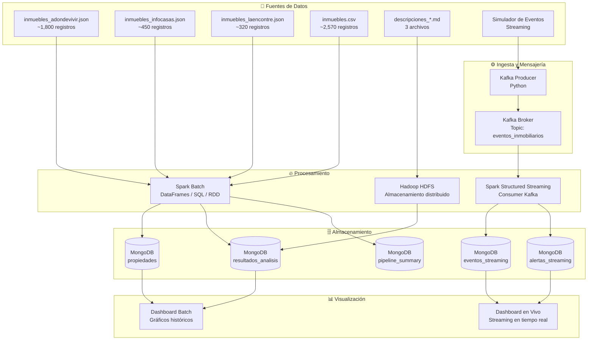

# Arquitectura AA4 — Análisis de Mercado Inmobiliario con Ecosistema Big Data

## Descripción General

La arquitectura AA4 extiende el ecosistema batch de AA3 incorporando procesamiento en tiempo real mediante **Apache Kafka** y **Spark Structured Streaming**, permitiendo análisis de eventos inmobiliarios en vivo junto con el pipeline batch existente.

---

## Diagrama de Arquitectura



---

## Componentes y Roles

### 1. Fuentes de Datos

| Componente                   | Descripción                                                                                       |
| ---------------------------- | ------------------------------------------------------------------------------------------------- |
| `inmuebles_adondevivir.json` | Datos scrapeados de AdondeVivir (~1,800 registros). Fuente principal.                             |
| `inmuebles_infocasas.json`   | Datos scrapeados de InfoCasas (~450 registros).                                                   |
| `inmuebles_laencontre.json`  | Datos scrapeados de LaEncontre (~320 registros).                                                  |
| `inmuebles.csv`              | Dataset consolidado y transformado. Input directo para Spark Batch.                               |
| `descripciones_*.md`         | Archivos de texto descriptivo por fuente. Procesados por Hadoop.                                  |
| Simulador de eventos         | Script Python que genera eventos inmobiliarios aleatorios en tiempo real para el flujo streaming. |

---

### 2. Ingesta y Mensajería (Apache Kafka)

| Componente         | Descripción                                                                                                                    |
| ------------------ | ------------------------------------------------------------------------------------------------------------------------------ |
| **Kafka Producer** | Script Python que publica eventos inmobiliarios al topic de Kafka. Simula búsquedas, consultas y transacciones en tiempo real. |
| **Kafka Broker**   | Nodo broker de Kafka que gestiona el topic `eventos_inmobiliarios`. Retención configurable.                                    |
| **Zookeeper**      | Coordinador de Kafka (o KRaft en versiones recientes). Gestiona el estado del clúster.                                         |

---

### 3. Procesamiento

| Componente                     | Descripción                                                                                                                                                 |
| ------------------------------ | ----------------------------------------------------------------------------------------------------------------------------------------------------------- |
| **Spark Batch**                | Procesa los archivos históricos. Usa DataFrames para análisis de precios, RDD para transformaciones personalizadas y Spark SQL para consultas declarativas. |
| **Spark Structured Streaming** | Consume mensajes de Kafka en micro-batches. Aplica ventanas de tiempo, detección de anomalías y genera alertas.                                             |
| **Hadoop HDFS**                | Almacena los archivos `.md` de descripciones. Spark lee desde HDFS para el análisis de texto.                                                               |

---

### 4. Almacenamiento (MongoDB)

| Colección             | Descripción                                                                                       |
| --------------------- | ------------------------------------------------------------------------------------------------- |
| `propiedades`         | Inmuebles crudos y procesados del pipeline batch. Actualización por upsert.                       |
| `resultados_analisis` | Resultados de análisis Spark: promedios, distribuciones, rankings por zona.                       |
| `eventos_streaming`   | Eventos inmobiliarios recibidos vía Kafka y procesados por Spark Streaming.                       |
| `alertas_streaming`   | Alertas generadas automáticamente cuando se detectan precios anómalos o alta demanda en una zona. |
| `pipeline_summary`    | Historial de ejecuciones del pipeline: fecha, duración, registros procesados, estado.             |

---

### 5. Visualización

| Componente              | Descripción                                                                                                       |
| ----------------------- | ----------------------------------------------------------------------------------------------------------------- |
| **Dashboard Batch**     | Muestra análisis históricos: precios por distrito, distribución de tipos de inmueble, comparativas entre fuentes. |
| **Dashboard Streaming** | Muestra eventos en tiempo real: conteo de eventos por zona, alertas activas, precio promedio deslizante.          |

---

## Flujo de Datos — Batch

```
Scrapers → JSON/CSV → Spark Batch → MongoDB (propiedades, resultados_analisis)
                                  → HDFS (descripciones)
                                  → MongoDB (pipeline_summary)
                                  → Dashboard Batch
```

## Flujo de Datos — Streaming

```
Simulador → Kafka Producer → Kafka Topic → Spark Structured Streaming
                                         → MongoDB (eventos_streaming)
                                         → MongoDB (alertas_streaming)
                                         → Dashboard en Vivo
```

---

## Tecnologías

| Tecnología              | Versión | Rol                                                  |
| ----------------------- | ------- | ---------------------------------------------------- |
| Apache Spark            | 3.x     | Procesamiento batch y streaming                      |
| Apache Kafka            | 3.x     | Mensajería y streaming de eventos                    |
| Apache Hadoop           | 3.x     | Almacenamiento HDFS                                  |
| MongoDB                 | 6.x     | Base de datos NoSQL principal                        |
| Python                  | 3.10+   | Scrapers, productores Kafka, scripts de orquestación |
| Docker / Docker Compose | Latest  | Contenedorización del ecosistema                     |
| Zookeeper               | 3.x     | Coordinación Kafka                                   |

---

## Consideraciones de Calidad de Datos

- El pipeline batch usa **upsert** en MongoDB para no sobrescribir datos previos.
- Cada ejecución del pipeline genera un documento en `pipeline_summary` con ID único.
- El streaming usa **checkpointing** de Spark para tolerancia a fallos.
- Los eventos streaming se almacenan con timestamp de ingesta para trazabilidad.
