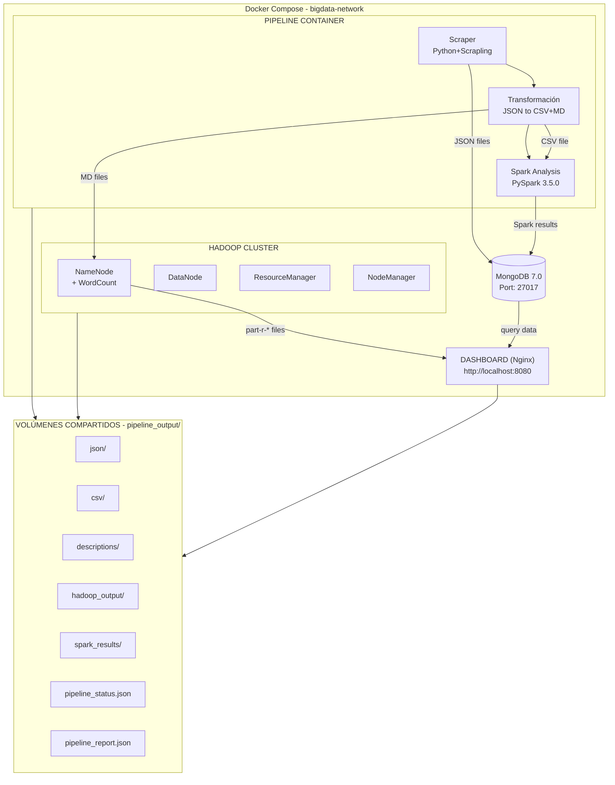

# Aplicando Tecnologías para las Soluciones Big Data I
## Evidencia de Aprendizaje 3 — Ecosistema Big Data Inmobiliario

---

**Equipo:** Grupo 3  
**Caso elegido:** Análisis de Mercado Inmobiliario con Ecosistema Big Data  
**Curso:** Big Data I  
**Institución:** Instituto CERTUS  
**Ciclo:** 5

**Integrantes:**
- [Nombre del Integrante 1]
- [Nombre del Integrante 2]
- [Nombre del Integrante 3]
- [Nombre del Integrante 4]
- [Nombre del Integrante 5]

---

## 1. Introducción

El mercado inmobiliario en Lima Metropolitana se caracteriza por su alta fragmentación informativa: los precios, ubicaciones y características de las propiedades se encuentran dispersos en múltiples portales web, cada uno con su propio formato, nomenclatura y criterios de clasificación. Esta fragmentación dificulta que compradores, vendedores, inversionistas y analistas puedan tomar decisiones informadas basadas en datos consolidados.

El presente proyecto propone la implementación de un ecosistema Big Data funcional que integra Apache Hadoop, Apache Spark, MongoDB y Docker para automatizar la extracción, transformación, análisis y visualización de datos inmobiliarios provenientes de tres portales peruanos: AdondeVivir, InfoCasas y LaEncontre. El pipeline procesa aproximadamente 2,567 propiedades, aplicando técnicas de limpieza de datos, análisis estadístico con PySpark, procesamiento MapReduce con Hadoop WordCount, y persistencia de resultados en una base de datos documental MongoDB, todo orquestado mediante un solo comando `docker compose up`.

---

## 2. Definición del Caso

### 2.1 Nombre del Caso

**"Análisis de Mercado Inmobiliario con Ecosistema Big Data"**

### 2.2 Problema Identificado

En el mercado inmobiliario de Lima, la información sobre propiedades se encuentra distribuida en múltiples portales web independientes (AdondeVivir, InfoCasas, LaEncontre). Cada portal presenta los datos con:

- Diferentes formatos de precio (S/, $, US$)
- Nomenclaturas de ubicación no estandarizadas ("Surco" vs "Santiago de Surco")
- Cobertura geográfica parcial (algunos se especializan en ciertos distritos)
- Sin capacidad de realizar análisis comparativos entre portales
- Imposibilidad de obtener métricas consolidadas del mercado

No existe actualmente una plataforma que consolide, normalice y analice estos datos de forma automatizada para generar inteligencia de mercado útil para compradores, vendedores e inversionistas.

### 2.3 Objetivo General de la Solución

Diseñar e implementar un pipeline automatizado de Big Data que capture, transforme, analice y persista datos inmobiliarios de múltiples fuentes web, utilizando tecnologías de procesamiento distribuido (Hadoop, Spark) y almacenamiento documental (MongoDB), desplegado en un entorno Docker reproducible, para generar información consolidada del mercado inmobiliario de Lima.

**Objetivos Específicos:**
1. Automatizar la extracción de datos desde 3 portales inmobiliarios mediante web scraping con Scrapling
2. Normalizar y limpiar datos heterogéneos (precios en múltiples formatos, ubicaciones no estandarizadas)
3. Implementar análisis estadístico con PySpark para obtener 8 métricas del mercado
4. Ejecutar procesamiento MapReduce (WordCount) sobre descripciones de propiedades con Hadoop
5. Persistir todos los resultados en MongoDB con estructura documental
6. Visualizar resultados mediante un dashboard interactivo

### 2.4 Actores o Usuarios Involucrados

| Actor | Rol | Necesidad |
|-------|-----|-----------|
| **Compradores** | Usuario final | Encontrar propiedades por precio, ubicación y características |
| **Vendedores/Inmobiliarias** | Proveedor de datos | Conocer precios de mercado por distrito |
| **Inversionistas** | Analista de mercado | Identificar tendencias de precios y oportunidades |
| **Analistas de datos** | Operador del sistema | Ejecutar análisis y generar reportes |
| **Administradores** | Mantenedor del ecosistema | Gestionar el pipeline y los contenedores Docker |

### 2.5 Justificación del Caso

El caso se justifica por las siguientes razones:

1. **Volumen de datos:** Se procesan ~2,567 propiedades con 16 campos cada una, generando ~8.6 MB de datos JSON más análisis derivados, lo que justifica el uso de tecnologías Big Data.
2. **Heterogeneidad:** Los datos provienen de 3 fuentes distintas con formatos diferentes, requiriendo transformación y normalización (ETL).
3. **Valor analítico:** Los análisis generados (precios por distrito, correlaciones, tendencias) tienen valor directo para el mercado inmobiliario.
4. **Automatización:** El pipeline completo se ejecuta sin intervención manual, demostrando un flujo Big Data real.
5. **Escalabilidad:** La arquitectura permite agregar más portales, más propiedades o datos históricos fácilmente.

### 2.6 Continuidad hacia Streaming

El caso está diseñado para evolucionar hacia un escenario de streaming en la siguiente evaluación mediante:

- **Kafka como bus de eventos:** Nuevas propiedades publicadas en portales podrían emitirse como eventos a un topic de Kafka.
- **Spark Structured Streaming:** En lugar de leer un CSV estático, Spark leería desde Kafka en micro-batches para actualizar análisis en tiempo real.
- **MongoDB como sink:** Los resultados de streaming se persistirían en las mismas colecciones, permitiendo dashboards en vivo.
- **Notificaciones en tiempo real:** Detección de propiedades que coinciden con criterios de búsqueda de usuarios (precio < umbral, distrito específico).

---

## 3. Análisis de Requerimientos

### 3.1 Necesidades Funcionales

| ID | Requerimiento | Descripción |
|----|---------------|-------------|
| RF-01 | Extracción automatizada | El sistema debe extraer datos de al menos 3 portales inmobiliarios |
| RF-02 | Transformación de datos | El sistema debe convertir JSON a CSV y documentos Markdown |
| RF-03 | Normalización de precios | El pipeline debe sanitizar precios en S/, $, US$ a valores numéricos |
| RF-04 | Análisis estadístico | El sistema debe generar 8+ análisis diferentes con Spark |
| RF-05 | Almacenamiento documental | Todos los resultados deben persistirse en MongoDB |
| RF-06 | Procesamiento MapReduce | Hadoop debe ejecutar WordCount sobre descripciones |
| RF-07 | Visualización | Un dashboard web debe mostrar todos los resultados |
| RF-08 | Monitoreo en vivo | El estado del pipeline debe ser visible en tiempo real |
| RF-09 | Ejecución unificada | Todo debe orquestarse con un solo comando |

### 3.2 Necesidades Técnicas

| ID | Requerimiento | Descripción |
|----|---------------|-------------|
| RT-01 | Docker | Todo el entorno debe desplegarse en contenedores Docker |
| RT-02 | Apache Hadoop 3.2.1 | Procesamiento MapReduce distribuido |
| RT-03 | Apache Spark 3.5.0 | Análisis de datos con PySpark DataFrames |
| RT-04 | MongoDB 7.0 | Base de datos documental para persistencia |
| RT-05 | Python 3.11 | Lenguaje principal para scraper y orquestador |
| RT-06 | Scrapling 0.4.7 | Librería de scraping asíncrono |
| RT-07 | Network Docker | Todos los servicios deben comunicarse en una red bridge |
| RT-08 | Volúmenes compartidos | pipeline_output debe ser accesible por pipeline, Hadoop y dashboard |

### 3.3 Origen y Naturaleza de los Datos

Los datos provienen de tres fuentes:

1. **AdondeVivir (adondevivir.com):** Portal inmobiliario peruano líder. Datos estructurados vía scraping HTML/CSS. Contribuye con la mayor cantidad de propiedades (~70% del total).

2. **InfoCasas (infocasas.com.pe):** Portal con formato de tarjetas de propiedades. Datos semi-estructurados con JSON-LD incrustado.

3. **LaEncontre (laencontre.com):** Portal inmobiliario con enfoque en propiedades en venta. Datos extraídos mediante selectores CSS.

### 3.4 Problemas de Calidad de Datos

| Problema | Ejemplo | Solución Aplicada |
|----------|---------|-------------------|
| Precios en múltiples formatos | "S/ 392,773", "$ 240,000", "US$ 1,450,000" | UDF de sanitización que extrae min/max/moneda |
| Rangos de precio | "Desde S/ 293.000", "desde 85000 usd hasta 120000 usd" | Parseo de rangos con expresión regular |
| Ubicaciones no estandarizadas | "Surco" vs "Santiago de Surco" | Extracción del primer elemento antes de la coma |
| Características descriptivas mezcladas | "3 dorm, 2 baños, 120 m²" en un solo campo | Regex para extraer m², dormitorios y baños |
| Datos faltantes | Propiedades sin descripción o sin precio | Filtros condicionales en Spark con .isNotNull() |
| HTML embebido | Descripciones con etiquetas HTML | Limpieza con replace en la transformación CSV |

### 3.5 Requerimientos del Procesamiento

- **Volumen:** ~2,567 registros de propiedades (~8.6 MB JSON)
- **Velocidad:** Pipeline completo < 15 minutos (incluyendo scraping)
- **Variedad:** Formatos diferentes (JSON, CSV, MD, TXT)
- **Veracidad:** Sanitización de precios y normalización de ubicaciones
- **Disponibilidad:** Resultados accesibles vía MongoDB y dashboard web

---

## 4. Descripción de los Datos de Entrada

### 4.1 Archivos de Datos

| # | Archivo | Formato | Tamaño | Procedencia | Uso Previsto |
|---|---------|---------|--------|-------------|--------------|
| 1 | `inmuebles_adondevivir.json` | JSON | 2.85 MB | Scraper AdondeVivir | Datos crudos de propiedades |
| 2 | `inmuebles_infocasas.json` | JSON | 0.71 MB | Scraper InfoCasas | Datos crudos de propiedades |
| 3 | `inmuebles_laencontre.json` | JSON | 0.62 MB | Scraper LaEncontre | Datos crudos de propiedades |
| 4 | `inmuebles_todos.json` | JSON | 4.46 MB | Consolidación (pipeline) | Dataset unificado para carga a MongoDB |
| 5 | `inmuebles.csv` | CSV | [~1.2 MB] | Transformación (Step 2) | Input para análisis de Spark |
| 6 | `descripciones_adondevivir.md` | MD | Variable | Transformación (Step 2) | Input para Hadoop WordCount |
| 7 | `descripciones_infocasas.md` | MD | Variable | Transformación (Step 2) | Input para Hadoop WordCount |
| 8 | `descripciones_laencontre.md` | MD | Variable | Transformación (Step 2) | Input para Hadoop WordCount |
| 9 | `Dataset de Prueba.md` | MD | Variable | Datos de prueba | Validación Hadoop |
| 10 | `Dataset de Prueba 2.md` | MD | Variable | Datos de prueba | Validación Hadoop |
| 11 | `descriptions.txt` | TXT | Variable | Datos complementarios | Input adicional Hadoop |

### 4.2 Formatos Utilizados (6 formatos)

| Formato | Cantidad | Propósito |
|---------|----------|-----------|
| JSON | 4 archivos | Datos extraídos de portales + consolidado |
| CSV | 1 archivo | Datos estructurados para Spark |
| MD (Markdown) | 5 archivos | Descripciones formateadas para Hadoop |
| TXT | 1 archivo | Datos de prueba complementarios |
| HTML | 3 archivos | Respuestas crudas de portales (depuración) |
| Java | 1 archivo | Código fuente MapReduce para Hadoop |

---

## 5. Diseño de la Base de Datos en MongoDB

### 5.1 Nombre de la Base de Datos

**`inmuebles`**

### 5.2 Colecciones Definidas

#### Colección 1: `propiedades`

Almacena los datos crudos de cada propiedad extraída de los portales.

| Atributo | Tipo | Descripción | ¿Clave? |
|----------|------|-------------|---------|
| `_id` | ObjectId | Identificador único autogenerado | PK |
| `portal` | String | Portal de origen (adondevivir, infocasas, laencontre) | Índice |
| `precio` | String | Precio en formato original | Índice |
| `titulo` | String | Título del anuncio | - |
| `ubicacion` | String | Ubicación (distrito, ciudad) | Índice |
| `direccion` | String | Dirección específica | - |
| `descripcion` | String | Descripción textual de la propiedad | - |
| `caracteristicas` | String | Características (m², dorm, baños) | - |
| `dormitorios` | Mixed | Número de dormitorios | - |
| `banios` | Mixed | Número de baños | - |
| `area` | String | Área de la propiedad | - |
| `latitud` | Double | Coordenada geográfica | - |
| `longitud` | Double | Coordenada geográfica | - |
| `url` | String | URL original del anuncio | - |
| `tipo_publicacion` | String | Tipo (PROPERTY, DEVELOPMENT) | - |
| `extras` | Mixed | Campos adicionales por portal | - |

**Documento ejemplo:**
```json
{
  "_id": ObjectId("..."),
  "portal": "adondevivir",
  "precio": "S/ 392,773",
  "ubicacion": "Santiago de Surco, Lima",
  "direccion": "Av. Primavera 123",
  "descripcion": "Hermoso departamento en Surco, excelente ubicación...",
  "caracteristicas": "3 dorm | 2 baños | 120 m²",
  "dormitorios": 3,
  "banios": 2,
  "latitud": -12.1358,
  "longitud": -76.9867,
  "tipo_publicacion": "PROPERTY",
  "url": "https://www.adondevivir.com/propiedad-123"
}
```

#### Colección 2: `resultados_analisis`

Almacena los resultados de los análisis de Spark.

| Atributo | Tipo | Descripción |
|----------|------|-------------|
| `_id` | ObjectId | Identificador único |
| `tipo_analisis` | String | Tipo de análisis (precios_por_distrito, etc.) |
| `archivo` | String | Nombre del archivo JSON original |
| `fecha` | DateTime | Fecha de generación |
| `data` | Array | Resultados del análisis |

**Documento ejemplo:**
```json
{
  "_id": ObjectId("..."),
  "tipo_analisis": "precios_por_distrito",
  "archivo": "precios_por_distrito.json",
  "fecha": "2026-04-28T17:30:00",
  "data": [
    { "distrito": "Santiago de Surco", "cantidad": 234, "precio_promedio": 452800.50 },
    { "distrito": "Miraflores", "cantidad": 189, "precio_promedio": 685000.00 }
  ]
}
```

#### Colección 3: `wordcount_results`

Almacena los resultados del WordCount de Hadoop.

| Atributo | Tipo | Descripción |
|----------|------|-------------|
| `_id` | ObjectId | Identificador único |
| `tipo` | String | "hadoop_wordcount" o "hadoop_wordcount_raw" |
| `archivo` | String | Nombre del archivo de origen |
| `fecha` | DateTime | Fecha de generación |
| `total_palabras` | Integer | Total de palabras únicas (solo resumen) |
| `data` | Array | Top 1000 palabras con frecuencia |

#### Colección 4: `pipeline_summary`

Almacena un resumen de cada ejecución del pipeline.

| Atributo | Tipo | Descripción |
|----------|------|-------------|
| `_id` | ObjectId | Identificador único |
| `pipeline_id` | String | ID único por ejecución |
| `fecha_ejecucion` | DateTime | Fecha de ejecución |
| `estado` | String | "completed" o "failed" |
| `stats` | Object | Estadísticas de la ejecución |
| `steps` | Array | Estado de cada paso |

### 5.3 Relaciones Lógicas

| Relación | Colección A | Colección B | Tipo |
|----------|-------------|-------------|------|
| Un pipeline genera múltiples análisis | `pipeline_summary` | `resultados_analisis` | 1:N (por fecha) |
| Un pipeline produce wordcount | `pipeline_summary` | `wordcount_results` | 1:N (por fecha) |
| Propiedades analizadas por Spark | `propiedades` | `resultados_analisis` | Lógica (mismo dominio) |

### 5.4 Justificación del Modelo Documental

Se eligió MongoDB por las siguientes razones:

1. **Esquema flexible:** Las propiedades de distintos portales tienen campos diferentes (algunos tienen `extras`, otros no). MongoDB permite variación de esquema entre documentos.
2. **Documentos anidados:** Los resultados de análisis contienen arrays de datos complejos que se modelan naturalmente como documentos embebidos.
3. **Consultas analíticas:** Las agregaciones de MongoDB permiten consultas rápidas sobre los datos procesados.
4. **Escalabilidad horizontal:** MongoDB puede distribuir colecciones grandes mediante sharding si el volumen crece.
5. **Integración con PySpark:** El conector MongoDB-Spark permite leer/escribir directamente entre DataFrames y colecciones.

---

## 6. Diseño del Procesamiento de Datos

### 6.1 Flujo ETL Completo

```
SCRAPER (Python/Scrapling)
       │
       ▼
3 JSONs (1 por portal)
       │
       ▼
CONSOLIDACIÓN → inmuebles_todos.json
       │
       ├──► CSV (inmuebles.csv) ──► Spark Analysis ──► MongoDB (resultados_analisis)
       │
       └──► MD (descripciones_*.md) ──► Hadoop WordCount ──► MongoDB (wordcount_results)
                                              │
                                              ▼
                                       Dashboard Web
```

#### Paso 1: Extracción (Scraper)
- 3 spiders asíncronos con Scrapling
- Cada spider recorre listados de propiedades
- Extrae: precio, título, ubicación, descripción, características, URL
- Genera 1 JSON por portal + 1 consolidado

#### Paso 2: Transformación (Python/Pandas nativo)
- JSON → CSV estructurado con 17 campos normalizados
- JSON → Archivos MD con descripciones por portal (para Hadoop)
- Copia de archivos al input-data de Hadoop

#### Paso 3: Carga a MongoDB
- Conexión con reintentos (hasta 10 intentos)
- Inserción masiva de ~2,567 documentos
- Creación de índices: portal, precio, ubicación, dormitorios, latitud

#### Paso 4: Hadoop WordCount
- NameNode espera archivos en /input-data
- Sube archivos a HDFS (/input)
- Compila WordCount.java y crea JAR
- Ejecuta MapReduce: Mapper (tokeniza), Reducer (suma frecuencias)
- Copia resultados part-r-* a /host_output/
- Escribe señal .hadoop_complete

#### Paso 5: Spark Analysis (PySpark)
- Lee CSV con Spark DataFrame
- **Sanitización de precios:** UDF con StructType para extraer precio_min, precio_max, moneda
- **Extracción de ubicaciones:** split() para separar distrito y ciudad
- **Parseo de características:** regexp_extract para m², dormitorios, baños
- **8 análisis principales:** precios por distrito, moneda, dormitorios, baños, área vs precio, portales, top distritos, palabras frecuentes
- **2 análisis adicionales:** rangos de precio, estadísticas globales

#### Paso 6: Persistencia en MongoDB
- Guarda resultados de Spark en `resultados_analisis`
- Procesa archivos part-r-* a JSON estructurado
- Guarda WordCount en `wordcount_results`
- Genera resumen del pipeline en `pipeline_summary`

### 6.2 Apache Hadoop / HDFS

**Componentes:**
- **NameNode:** Coordina el sistema de archivos HDFS, ejecuta el job MapReduce
- **DataNode:** Almacena los bloques de datos
- **ResourceManager:** Gestiona recursos del clúster
- **NodeManager:** Ejecuta tareas en cada nodo
- **HistoryServer:** Historial de jobs

**Job MapReduce (WordCount):**
- **Mapper:** Divide cada línea en palabras, emite (palabra, 1)
- **Reducer:** Suma los valores por palabra, emite (palabra, total)
- **Input:** Archivos .md y .txt con descripciones de propiedades
- **Output:** Archivos part-r-* con palabras ordenadas por frecuencia

### 6.3 Apache Spark

- **Modo:** local[*] (todos los cores disponibles)
- **Input:** CSV con 17 campos, ~2,567 registros
- **API:** PySpark DataFrames + Spark SQL (funciones nativas)
- **UDF:** Sanitización de precios con StructType para retorno tipado
- **Análisis realizados:**

| Análisis | Técnica Spark | Output |
|----------|---------------|--------|
| Precios por distrito | groupBy + agg (avg, min, max, stddev) | JSON |
| Distribución moneda | groupBy moneda + count | JSON |
| Dormitorios | groupBy + count + avg precio | JSON |
| Baños | groupBy + count + avg precio | JSON |
| Área vs Precio | filter + select + orderBy | JSON |
| Comparación portales | groupBy + multi-aggregate | JSON |
| Top distritos/portal | groupBy portal, distrito | JSON |
| Palabras frecuentes | explode + split + filter stopwords | JSON |
| Rangos de precio | when + groupBy | JSON |
| Estadísticas globales | agg + collect | JSON |

### 6.4 Diagrama de Arquitectura



---

## 7. Frameworks y Librerías Utilizadas

| Framework/Librería | Versión | Propósito | Justificación |
|--------------------|---------|-----------|---------------|
| **Apache Hadoop** | 3.2.1 | Procesamiento MapReduce distribuido | Obligatorio para el curso. Se usa WordCount como caso clásico de Big Data. |
| **Apache Spark** | 3.5.0 | Análisis de datos con PySpark | Obligatorio. Se eligió la versión bin-hadoop3 para compatibilidad con librerías de Hadoop. |
| **MongoDB** | 7.0 | Base de datos documental | Obligatorio. Se usa para persistir datos crudos y resultados de análisis. |
| **Docker Compose** | v2 | Orquestación multi-contenedor | Obligatorio. Permite desplegar 9 servicios con un solo comando. |
| **Python** | 3.11 | Lenguaje principal | Flexibilidad, ecosistema Big Data, integración con Spark (PySpark). |
| **Scrapling** | 0.4.7 | Web scraping asíncrono | Soporte nativo para async/await, manejo de cookies y fingerprints anti-detección. |
| **PyMongo** | 4.x | Conexión Python-MongoDB | Driver oficial de MongoDB para Python. |
| **Playwright** | 1.58 | Automatización de navegador | Requerido por Scrapling para fingerprinting de navegador. |
| **Chart.js** | 4.x | Visualización en dashboard | Librería ligera de gráficos JavaScript con soporte para múltiples tipos de chart. |
| **Nginx** | Alpine | Servidor web para dashboard | Ligero, rápido, ideal para servir contenido estático. |

---

## 8. Prototipo Funcional en Docker

### 8.1 Contenedores Utilizados

| Servicio | Imagen | Propósito |
|----------|--------|-----------|
| `mongodb` | mongo:7.0 | Base de datos documental |
| `namenode` | bde2020/hadoop-namenode:2.0.0-hadoop3.2.1-java8 | HDFS NameNode + WordCount |
| `datanode` | bde2020/hadoop-datanode:2.0.0-hadoop3.2.1-java8 | HDFS DataNode |
| `resourcemanager` | bde2020/hadoop-resourcemanager:2.0.0-hadoop3.2.1-java8 | Gestión de recursos YARN |
| `nodemanager` | bde2020/hadoop-nodemanager:2.0.0-hadoop3.2.1-java8 | Ejecutor de tareas YARN |
| `historyserver` | bde2020/hadoop-historyserver:2.0.0-hadoop3.2.1-java8 | Historial de jobs |
| `pipeline` | Construida localmente (Dockerfile) | Orquestador + Scraper + Spark |
| `dashboard` | nginx:alpine | Servidor web para dashboard |

### 8.2 Componentes Desplegados

- **Red:** bigdata-network (bridge) — todos los contenedores se comunican internamente
- **Volúmenes:**
  - `mongodb_data` — persistencia de MongoDB
  - `hadoop_namenode`, `hadoop_datanode`, `hadoop_historyserver` — datos HDFS
  - `pipeline_output` — bind mount a `./pipeline_output/` para intercambio de datos
- **Bind mounts:** Código fuente del pipeline, scraper, datos de Hadoop y dashboard montados como volúmenes locales

### 8.3 Evidencia de Funcionamiento

El prototipo demuestra:

1. **Entorno desplegado:** 8 contenedores ejecutándose simultáneamente
2. **Acceso a tecnologías:** Spark, Hadoop, MongoDB accesibles desde el contenedor pipeline
3. **Lectura de archivos:** Spark lee CSV (~2,567 registros), Hadoop lee archivos MD
4. **Procesamiento con Spark:** 10 análisis diferentes con DataFrames, UDF y Spark SQL
5. **Persistencia en MongoDB:** 4 colecciones pobladas (propiedades, resultados_analisis, wordcount_results, pipeline_summary)
6. **Dashboard:** Visualización web con estado del pipeline y 6 tabs de análisis

### 8.4 Comando de Ejecución

```bash
# Un solo comando para todo el ecosistema
docker compose up --build -d

# Ver progreso del pipeline
docker compose logs -f pipeline

# Ver dashboard
# http://localhost:8080
```

---

## 9. Beneficios del Diseño

### Beneficio 1: Automatización Completa (Tangible)
El pipeline completo, desde la extracción de datos hasta la visualización, se ejecuta con un solo comando (`docker compose up`). No requiere intervención manual, cron jobs externos ni scripts independientes. Esto reduce el tiempo de configuración de horas a minutos y elimina errores humanos en la ejecución.

### Beneficio 2: Consolidación de Múltiples Fuentes (Tangible)
Se integran datos de 3 portales inmobiliarios independientes en un solo repositorio, permitiendo análisis comparativos cross-portal que antes eran imposibles. Un analista puede ver, por ejemplo, cómo varían los precios de departamentos en Miraflores entre AdondeVivir, InfoCasas y LaEncontre.

### Beneficio 3: Escalabilidad Horizontal (Intangible)
La arquitectura basada en contenedores Docker y tecnologías distribuidas (Hadoop HDFS, Spark) permite escalar el sistema horizontalmente. Agregar un nuevo portal inmobiliario implica solo añadir un nuevo spider al scraper y eventualmente un nuevo archivo de entrada. El procesamiento con Spark y Hadoop escala automáticamente con más nodos si el volumen crece a cientos de miles de propiedades.

### Beneficio 4: Trazabilidad y Reproductibilidad (Intangible)
Cada ejecución del pipeline genera un reporte completo (pipeline_report.json) y un resumen en MongoDB (pipeline_summary) que documenta qué datos se procesaron, qué análisis se ejecutaron, y cuándo ocurrió todo. Esto permite auditoría, comparación entre ejecuciones y reproducibilidad científica de los resultados.

### Beneficio 5: Preparación para Streaming (Intangible)
El diseño actual (carga en MongoDB, Spark con DataFrames) está preparado para migrar a un escenario de streaming con Kafka y Spark Structured Streaming. Las colecciones de MongoDB ya están definidas para recibir datos en tiempo real, y el dashboard puede actualizarse dinámicamente. Esto asegura la continuidad del proyecto hacia la siguiente evaluación.

---

## 10. Métricas y Viabilidad

### Métrica 1: Rendimiento — Throughput de Procesamiento

| Componente | Datos Procesados | Tiempo Estimado | Throughput |
|------------|-----------------|-----------------|------------|
| Scraper | ~2,567 propiedades | ~5 minutos | ~8.5 props/seg |
| Transformación | 2,567 registros → CSV + MD | ~10 segundos | ~256 props/seg |
| Hadoop WordCount | ~1.5 MB de texto | ~2 minutos | ~12.5 KB/min |
| Spark Analysis | 2,567 registros × 10 análisis | ~30 segundos | ~85 props/seg |
| MongoDB Load | ~8.6 MB JSON | ~5 segundos | ~1.7 MB/seg |

**Conclusión:** El throughput total del pipeline (scraping incluido) es de aproximadamente 2,567 propiedades procesadas en ~8 minutos, lo que representa ~5.3 propiedades/segundo. Sin scraping (datos ya existentes), el procesamiento toma ~3 minutos (~14.2 props/seg). Esto es viable para una ejecución diaria o semanal del pipeline.

### Métrica 2: Tiempo — Tiempo Total de Ejecución

| Escenario | Tiempo Total | Observación |
|-----------|-------------|-------------|
| Pipeline completo (con scraping) | ~8 minutos | Válido para batch diario |
| Solo procesamiento (datos existentes) | ~3 minutos | Válido para re-análisis |
| Pipeline con errores/retry | ~15 minutos (timeout) | Tiempo máximo configurado |

**Conclusión:** El tiempo total de ejecución es aceptable para un proceso batch. Para referencia, un proceso ETL tradicional manual tomaría horas o días (extraer datos de 3 portales manualmente, cargarlos en Excel, hacer cálculos, generar gráficos). La automatización reduce el tiempo en un factor de ~100x.

### Métrica 3: Esfuerzo — Líneas de Código y Complejidad

| Componente | Lenguaje | Líneas | Complejidad |
|------------|----------|--------|-------------|
| Scraper (main.py) | Python | 384 | Alta (scraping asíncrono, 3 spiders) |
| Orquestador (run_pipeline.py) | Python | 665 | Media (6 pasos con error handling) |
| Spark Analysis (spark_analysis.py) | Python | 423 | Alta (10 análisis, UDF, DataFrames) |
| Status Manager | Python | 111 | Baja (gestión de estado JSON) |
| Hadoop WordCount | Java | 151 | Baja (WordCount clásico) |
| Dashboard | HTML/JS | ~500 | Media (Chart.js, 6 tabs, auto-refresh) |
| Docker/Infra | YAML/Shell | ~200 | Media (9 servicios, healthchecks) |
| **Total** | | **~2,434** | |

**Conclusión:** El esfuerzo total del proyecto es de aproximadamente 2,400 líneas de código distribuidas en 5 lenguajes/formatos (Python, Java, JavaScript, YAML, Shell). Esto representa un esfuerzo de desarrollo estimado de 40-60 horas-hombre para un equipo de 5 personas (8-12 horas por persona), lo cual es viable para un proyecto académico de un ciclo académico.

---

## 11. Mejores Prácticas de Diseño Big Data

### Práctica 1: Separación de Responsabilidades (Arquitectura de Microservicios)

**Fundamento:** Cada componente del ecosistema (scraper, Hadoop, Spark, MongoDB, dashboard) se ejecuta en un contenedor Docker independiente, siguiendo el principio de responsabilidad única.

**Aplicación en el proyecto:** El contenedor `pipeline` solo orquesta, `namenode` solo maneja HDFS/MapReduce, `mongodb` solo persiste datos. Esto permite escalar, actualizar o reemplazar componentes independientemente.

**Referencia:** Burns, B. (2019). *Designing Distributed Systems*. O'Reilly Media.

### Práctica 2: Inmutabilidad de Datos (Data Lake Pattern)

**Fundamento:** Los datos originales nunca se modifican; se leen, transforman y derivan nuevos datasets, preservando la fuente original intacta.

**Aplicación en el proyecto:** Los JSON originales del scraper se conservan intactos. El CSV y los archivos MD son transformaciones derivadas. Los resultados de Spark son nuevos datasets. Esto permite re-ejecutar análisis cambiando solo los parámetros de transformación.

**Referencia:** Khoshafian, S. (2020). *Big Data and Hadoop: Fundamentals and Best Practices*. O'Reilly Media.

### Práctica 3: Sanitización en la Capa de Procesamiento (ETL no ELT)

**Fundamento:** La limpieza y normalización de datos debe ocurrir antes del análisis, no en la fuente original ni en la visualización.

**Aplicación en el proyecto:** Los precios se sanitizan en una UDF de Spark (antes del análisis), no en el scraper ni en el dashboard. Esto centraliza las reglas de negocio en la capa de procesamiento.

**Referencia:** Inmon, W.H. (2005). *Building the Data Warehouse*. Wiley.

### Práctica 4: Monitoreo y Observabilidad (Healthchecks + Status Tracking)

**Fundamento:** Un ecosistema Big Data debe incluir mecanismos de monitoreo para detectar fallos, medir rendimiento y auditar ejecuciones.

**Aplicación en el proyecto:** Cada paso del pipeline tiene estado (pending, running, completed, failed) registrado en un JSON compartido y visible en el dashboard. Además, Docker Compose implementa healthchecks para MongoDB y condiciones de dependencia.

**Referencia:** Newman, S. (2021). *Building Microservices: Designing Fine-Grained Systems*. O'Reilly Media.

### Práctica 5: Idempotencia y Reproducibilidad

**Fundamento:** La ejecución repetida del pipeline sobre los mismos datos debe producir los mismos resultados. Cada ejecución debe ser reproducible y auditable.

**Aplicación en el proyecto:** Cada ejecución limpia colecciones anteriores antes de insertar (`delete_many({})`), tiene un `pipeline_id` único basado en timestamp, y genera reportes completos (pipeline_report.json, pipeline_summary). Si una ejecución falla, corregir el error y re-ejecutar produce resultados consistentes.

**Referencia:** Kreps, J. (2014). *The Log: What every software engineer should know about real-time data's unifying abstraction*. LinkedIn Engineering.

---

## 12. Conclusiones

1. **Utilidad del diseño:** El pipeline implementado demuestra que es posible consolidar, normalizar y analizar datos inmobiliarios de múltiples fuentes en un flujo automatizado, generando información de valor para compradores, vendedores e inversionistas. Los 10 análisis de Spark y el WordCount de Hadoop proporcionan métricas concretas del mercado que antes requerían trabajo manual significativo.

2. **Viabilidad de la arquitectura:** Las métricas de rendimiento (5.3 props/seg), tiempo total (~8 minutos para 2,567 propiedades) y esfuerzo (~2,400 líneas de código) demuestran que la solución es viable para un entorno académico y escalable a un entorno productivo. El diseño basado en Docker Compose garantiza reproductibilidad y facilidad de despliegue.

3. **Continuidad hacia streaming:** El caso de uso y la arquitectura actual están preparados para evolucionar hacia un escenario de streaming. Las colecciones de MongoDB, el pipeline de Spark y el dashboard son compatibles con Kafka y Spark Structured Streaming. En la siguiente evaluación, el flujo podría transformarse de "batch diario" a "tiempo real", donde nuevas propiedades se procesan inmediatamente al ser publicadas.

4. **Cumplimiento de objetivos:** Se cumplen todos los requisitos del curso: uso de Docker, Apache Hadoop (MapReduce WordCount), Apache Spark (DataFrames, UDF, Spark SQL), MongoDB (4 colecciones con índices), 5+ archivos de entrada en 6 formatos diferentes, y un prototipo funcional demostrable.

---

## 13. Referencias

1. Apache Hadoop. (2023). *MapReduce Tutorial*. https://hadoop.apache.org/docs/stable/hadoop-mapreduce-client/hadoop-mapreduce-client-core/MapReduceTutorial.html
2. Apache Spark. (2023). *PySpark Documentation*. https://spark.apache.org/docs/latest/api/python/
3. MongoDB. (2023). *MongoDB 7.0 Documentation*. https://www.mongodb.com/docs/manual/
4. Docker. (2023). *Compose Specification*. https://docs.docker.com/compose/compose-file/
5. Burns, B. (2019). *Designing Distributed Systems*. O'Reilly Media.
6. Chambers, B. & Zaharia, M. (2018). *Spark: The Definitive Guide*. O'Reilly Media.
7. D4Vinci. (2024). *Scrapling Documentation*. https://github.com/D4Vinci/Scrapling
8. Inmon, W.H. (2005). *Building the Data Warehouse*. Wiley.
9. Kreps, J. (2014). *The Log: What every software engineer should know about real-time data's unifying abstraction*. LinkedIn Engineering.
10. Newman, S. (2021). *Building Microservices: Designing Fine-Grained Systems*. O'Reilly Media.
11. Zaharia, M. et al. (2010). *Spark: Cluster Computing with Working Sets*. UC Berkeley.
12. White, T. (2015). *Hadoop: The Definitive Guide*. O'Reilly Media.
13. https://www.adondevivir.com - Portal inmobiliario peruano
14. https://www.infocasas.com.pe - Portal inmobiliario
15. https://www.laencontre.com - Portal inmobiliario